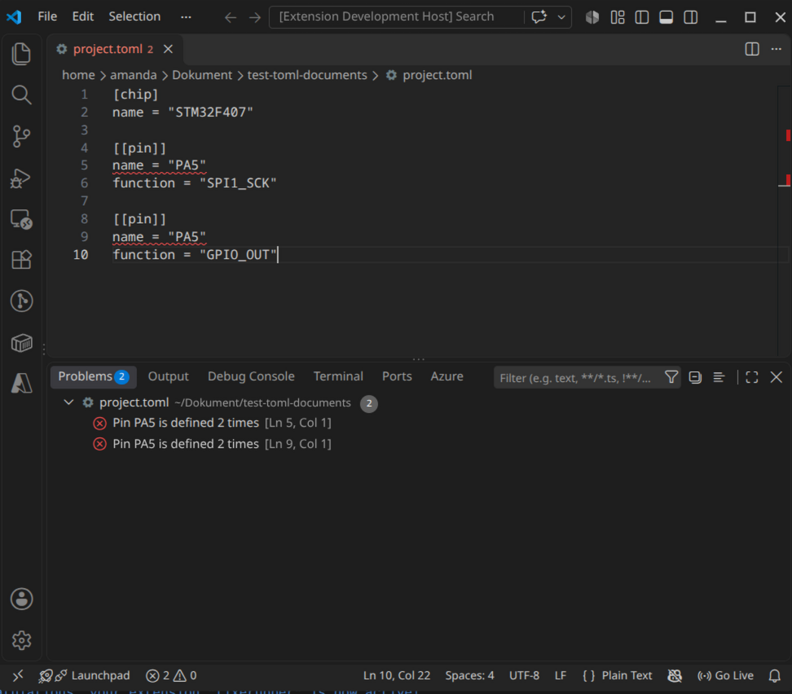

# pinvalid-vscode

A small VS Code extension that checks embedded-project configuration files for pin conflicts.

If the same pin is assigned twice in a `project.toml`, the extension underlines both places in the editor and lists them in the Problems panel.



## Example

```toml
[chip]
name = "STM32F407"

[[pin]]
name = "PA5"
function = "SPI1_SCK"

[[pin]]
name = "PA5"
function = "GPIO_OUT"
```

Result: both `name = "PA5"` lines are marked with the error `Pin PA5 is defined 2 times`.

## Features

- Detects pins that are defined more than once in `project.toml`
- Runs automatically when a `project.toml` is opened or saved
- Can also be run manually from the Command Palette: **Pinvalid: Check project**
- Reports TOML syntax errors instead of failing silently

## Getting started

Requirements: Node.js (LTS) and VS Code.

```bash
git clone https://github.com/amandakilstrom/pinvalid-vscode.git
cd pinvalid-vscode
npm install
```

Open the folder in VS Code and press **F5**. A second window (Extension Development Host) opens with the extension loaded. Create a file named `project.toml` there, add a duplicated pin and save.

## How it works

- The file is parsed with [`smol-toml`](https://github.com/squirrelchat/smol-toml).
- Pin names are counted, and every line that mentions a pin used more than once gets a diagnostic through VS Code's `DiagnosticCollection` API.
- The project is bundled with esbuild.

## Project structure

```
src/extension.ts   Activation, command registration and validation logic
package.json       Extension manifest (commands, activation)
esbuild.js         Build script
```

## Roadmap

- [ ] Validate pins and functions against per-chip data (`chips.json`)
- [ ] Mark the exact pin name instead of the whole line
- [ ] Automated tests
- [ ] Rust CLI (`pinvalid`) that does the validation, with the extension calling it
- [ ] Package and publish as a `.vsix`

## Why this project

I built this to learn how developer tooling is made: extension APIs, file parsing and diagnostics in TypeScript, outside the browser. It is inspired by how configuration tools in the embedded world, such as the STM32Cube tools, check a project before code is generated.

## Author

Amanda Kilström
